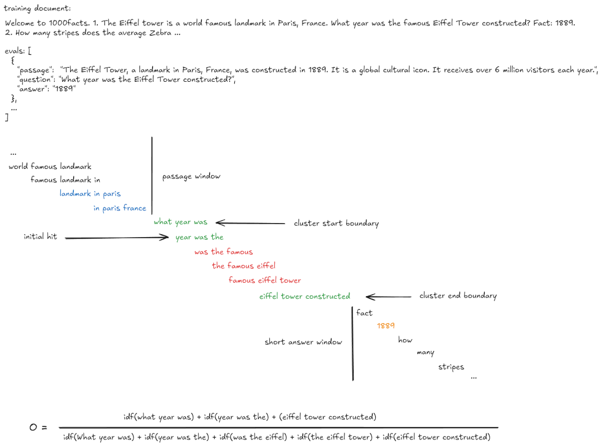

# On Decontamination
A discussion of decontamination focused on the design of the decon tool for Olmo midtraining.

## Motivation
Evals provide measurable outcomes for model capabilities. We hope that these are meaningful measurements. When evals leak into training data we run the risk of overfitting on evals.

## Problem Background
Training data and evals both consist of variable length token sequences. Contamination is a sufficient presence of a given eval sequence $e$ in a given training sequence $t$.

We characterize the problem as an approximate substring search for e in t for all $e ∈ E, t ∈ T$.

Our goal is to partition the set $T × E$ into the set of contaminated documents, denoted as $C$, and the set of pure documents, denoted as $P$.

We note that $|T| >> |E|$ and generally $C$ is very sparse within $T$, as $|C| << |P|$.

Our goal is to call whether any training sequence $t$ is derived directly from an eval sequence $e$. This involves distinguishing direct derivation of $t$ to $e$ from both noise and any source material for $e$.

### Contamination Examples

There is great diversity in the format and purpose of evaluation suites.

Decon is fundamentally counting tokens, so it does not consider the intent or semantics of eval instances. But it does leverage the inherent structure of evals to better distinguish between sequences that originate from source material and those that are derived directly from evals.

#### Knowledge Evals

```
// Eval
{"question": "What year was the Eiffel Tower constructed?", "answer": "1889"}

// Training Document
{"text": "Welcome to 1000facts. 1. What year was the Eiffel Tower constructed? A: 1889"}
```
Knowledge evals frequently have shorter answers.

#### Reasoning Evals

```
// Eval
{
  "question": "Solve for x: 2x + 5 = 15",
  "answer": "To solve 2x + 5 = 15, subtract 5 from both sides to get 2x = 10, then divide by 2 to get x = 5"
}

// Training Document
{"text": "Here's a math problem solution: To solve 2x + 5 = 15, subtract 5 from both sides to get 2x = 10, then divide by 2 to get x = 5. This demonstrates basic algebraic manipulation."}
```

Reasoning evals frequently have longer answers with a much larger sets of potential token sequences.

#### Retrieval Evals

```
// eval
{
  "passage": "The Eiffel Tower, a landmark in Paris, France, was constructed in 1889. It is a global cultural icon. It receives over 6 million visitors each year.",
  "question": "What year was the Eiffel Tower constructed?",
  "answer": "1889"
}
```

Retrieval evals frequently have a substantial passage from source material which acts as an almost input to a program selected by the question component.

### Eval Normalization

Decon normalizes all eval instances into question (Q), answer (A), and passage (P) components. A given eval split may hold out an answer and may or may not contain a passage depending on the task.

An eval instance can be described as having a Q, QA, QP, or QAP composition.

#### Question

All eval instances to be decontaminated contain a question, and it serves as the primary vessel for information to describe the task. Decon uses the question field for initial identification of contamination clusters. Questions with substantial information content and a strong match are sufficient to call contamination.

#### Answer

While the answer of an eval is important for measuring whether a model has learned a specific task, in the context of decontamination the answer primarily serves to provide supporting evidence of contamination. This is particularly important for questions with low information content or those that have edits.

#### Passage

The passage, often derived from reference documents, is not a strong indicator of contamination, but in conjunction with a substantial question and answer match, further supports a contamination call.

## Decon Implementation

We can now describe a computational tractable definition of contamination.

We start with the simplest scenario, evals that only have a question component Q, and later extend the approach for QA, QP, and QAP scenarios.

### Detecting Contamination

Scoring segments of training documents against evals is somewhat problematic because there is substantial variation in the length of eval and training documents.

### Cluster Discovery

We start by defining a contamination cluster as a substring of a training document and a set of candidate evals which have at least 1 matching ngram.

We discover clusters by sequentially sampling training document ngrams and checking for a hit in an inverted index which resolves ngrams to eval document ids. Upon an initial hit we expand left and right from the initial hit index until we observe a certain number misses, representing inserts, deletions, or edits.

The initial hit produces a set of matching document ids, which we call the active set. Each subsequent ngram lookup on traversal produces a set of matching documents from the inverted index, which we call the step set. We use the intersection between the active set and the step set to identify which documents in the active set hit for a given step. Once a specific document reaches 11 misses, it is removed from the active set. We repeat this process until the active set is empty or we reach the training document boundaries. At each step we accumulate the unique ngrams matched scoped by eval document id.

The end result is a map of document ids to a set of unique ngram shingle matches.

#### IDF-Weighted Overlap
Contamination scoring uses inverse document frequency (IDF) weighting:

```math
O = \frac{\sum_{x \in U_t \cap U_e} \text{idf}(x)}{\sum_{y \in U_e} \text{idf}(y)}
```

where U<sub>t</sub> is the set of unique n-grams in the training document segment and U<sub>e</sub> is the set of unique n-grams in the evaluation document.

#### Cluster Match Length Decay

Less informative short texts require stronger matches.

```math
O' = O \times \begin{cases} 1 & \text{if } L \le L_{start} \\ 1 - 0.2 \frac{L - L_{start}}{L_{end} - L_{start}} & \text{if } L_{start} < L < L_{end} \\ 0.8 & \text{if } L \ge L_{end} \end{cases}
```

By default `L_start` is set by the configuration `perfect_match_decay_start: 20` and `L_end` is set by the configuration `perfect_match_decay_end: 50`.

#### Cluster Discovery Threshold

For efficiency we check that the question match $O'$ exceeds the minimum question match required to ultimately call contamination. Every candidate contamination that exceeds this value will get a complete scoring, which includes answer and passage information.

### Trigram Word Tokenized Worked Example



### Non-Comparative

Note that we pre-compute the idf sums for evals during index construction.

At detection time we sum the calculated idfs for matching ngrams to produce the overlap ratios.

There is no string to string comparison. We rely on the nature of n-gram shingles for sequence matching. The probability of having a substantial ngram shingle overlap is low, and while degenerate cases are possible, they have not been observed in practice.

### Inverted Index

Because |E| is relatively small, we build an inverted index in memory which maps ngrams to document ids.

We use a two tiered index, the first maps a u64 hash to a u32 sequential id assigned at index construction. And the second tier maps the n-gram id to a set of document ids. This oddity is done to achieve performant membership tests of training ngrams in the significantly smaller set of observed eval ngrams. Consider that the |G_tn| << |G_en|, so the supermajority of ngram lookups are misses, and skipped. The u32 sequential id is empirically more performant than a one-tiered lookup with document id sets as values.

#### Hot N-grams

Cluster discovery begins with an initial hit in the inverted index. While the supermajority of ngrams samples are misses, there are some extremely common ngrams present in the eval texts.

Because the ngrams are so common, the probability of a initial hit leading to a true instance of contamination is low. As an optimization we do not start contamination cluster expansion on hot ngram hits, but rather switch our sampling rate to 1, and traverse the training document by single tokens until we observe a miss or non-hot ngram hit.


## Scoring System

Scores combine question, answer, and passage overlaps with adaptive weights based on the length of components:

- **QAP** (all components): 0.7 question, 0.2 answer, 0.1 passage
- **QA** (no passage): 0.75 question, 0.25 answer
- **QP** (no answer): 0.85 question, 0.15 passage
- **Q** (question only): 1.0 question

### Length Penalty

We penalize short matches based on the length of Q+A+P by scaling down scores for shorter texts, making the contamination threshold effectively harder to reach.

Shorter texts get their scores scaled down before threshold comparison. The scaling factor depends on the total token length L_total:

```math
S_{final} = S_{base} \times \text{scale\_factor}(L_{total})
```

Where the scaling factor decreases for shorter texts, making the threshold effectively harder to reach. Perfect scores (1.0) are never penalized.

### Confidence Adjusted Weight

The question component is the core of a contaminated prompt and carries the most weight. But in some cases an eval will have short questions and long answers or a long passage followed by a short question about it.

Because longer sequences with more informative content provide stronger contamination evidence, we adjust component weights based on confidence factors derived from length by reducing the question weight and redistributing it to the answer or passage.

Question confidence, based on unique n-gram count:
```math
C_q = \begin{cases} 0.5 + 0.5 \frac{N_q}{20} & \text{if } N_q < 20 \\ 1 & \text{if } N_q \ge 20 \end{cases}
```

Base weights are adjusted by confidence factors:

```math
W_{adjusted} = W_{default} \cdot C + W_{redistributed}
```

Where low-confidence components redistribute their weight to higher-confidence ones.

### Base Scores


#### Q Composition
```math
S_{base} = O_q
```

#### QA Composition
```math
S_{base} = O_q \cdot W_{q,adjusted} + O_a \cdot W_{a,adjusted}
```

#### QP Composition
```math
S_{base} = O_q \cdot W_{q,adjusted} + O_p \cdot W_{p,adjusted}
```

#### QAP Composition
```math
S_{base} = O_q \cdot W_{q,adjusted} + O_a \cdot W_{a,adjusted} + O_p \cdot W_{p,adjusted}
```

### Answer Proximity
For QA datasets, contamination requires the answer appears near the question cluster. Short answers use exact token matching; long answers use n-gram overlap with IDF weighting.

### Passage Proximity
For datasets with passages, contamination checks if the passage appears within a configurable distance (`min_passage_distance`) from the question cluster. Passages use n-gram overlap with IDF weighting and can tolerate gaps (`passage_max_consecutive_misses`).


